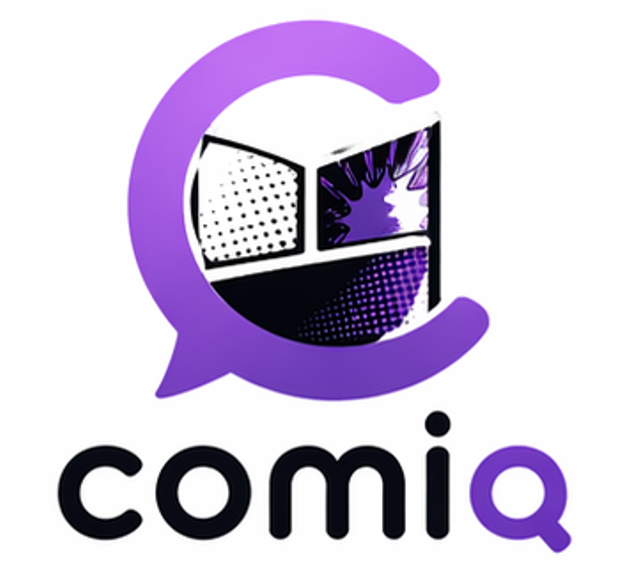

<div align="center">
  
  <h1>Comiq</h1>
  <p>A local-first comic book reader PWA — your files never leave your device</p>

[](https://www.typescriptlang.org)
[](https://react.dev)
[](https://web.dev/progressive-web-apps/)
[](LICENSE)

[Features](#features) • [Getting started](#getting-started) • [Usage](#usage) • [Architecture](#architecture) • [Development](#development)

</div>

---

Comiq is a fully client-side Progressive Web App for reading CBR, CBZ, and CBT comic archives. All extraction, thumbnail generation, and progress tracking run in the browser — nothing is ever uploaded. After the first load, the app works completely offline.

It offers two entry points:

- **Library Mode** — grant folder access once, browse a combined library with cover thumbnails and reading progress, and pick up where you left off across sessions.
- **Quick Read Mode** — select any single archive and start reading immediately, no setup needed, with session resume limited to the current tab.

> [!NOTE]
> Library Mode requires the [File System Access API](https://developer.mozilla.org/en-US/docs/Web/API/File_System_Access_API) and is supported on **Chromium-based desktop browsers** (Chrome, Edge) only. Quick Read works in any modern browser.

## Features

- **Three archive formats** — CBZ (ZIP), CBT (TAR), and CBR (RAR)
- **Persistent library** — multi-folder support, auto-generated cover thumbnails, per-comic reading progress, and a recently-read strip for the five most recent titles
- **Two reading layouts** — continuous scroll or page-flip, switchable mid-session without losing your position
- **Page-flip controls** — previous/next buttons, arrow-key navigation, and clockwise/anti-clockwise page rotation
- **Offline-capable** — installable PWA with Workbox service-worker app-shell caching
- **Worker-backed processing** — archive extraction, page preparation, and thumbnail generation all run off the main thread
- **Graceful degradation** — clear fallback messaging when Library Mode is unavailable, with recovery flows for corrupt archives, revoked permissions, and missing folders
- **No backend** — zero server uploads; all processing is local

## Getting started

### Prerequisites

- [Node.js](https://nodejs.org/) 20 or later
- A Chromium-based desktop browser (Chrome, Edge) for Library Mode

### Installation

```bash
git clone https://github.com/<your-username>/comiq.git
cd comiq
npm install
```

### Run locally

```bash
npm run dev
```

Open [http://localhost:5173/comiq/](http://localhost:5173/comiq/) in your browser.

## Usage

### Library Mode

1. Open the app in a Chromium-based desktop browser.
2. Click **Add folder** and grant access to a folder containing your comics.
3. Repeat for additional folders — all supported comics appear in one combined library view.
4. Click any comic to open it. Reading progress is saved by page number and restored in future sessions.
5. The home screen shows the five most recently read library comics for quick re-entry.
6. Click **Rescan** on a library source to pick up newly added files.
7. To remove a source, delete it from the source list — all its comics are removed with it.

> [!TIP]
> Comics that can no longer be found on disk are shown as unavailable but keep their progress record until the source is removed.

### Quick Read Mode

1. Click **Quick Read** (shown automatically when Library Mode is unavailable).
2. Select a CBR, CBZ, or CBT file from your device.
3. The reader opens immediately — no folder permission required.
4. Your position is preserved within the current tab session only and is not added to the library.

### Reading controls

| Action | Control |
|--------|---------|
| Next page | Right arrow / Down arrow / Next button |
| Previous page | Left arrow / Up arrow / Prev button |
| Rotate page | Rotation buttons in the toolbar |
| Switch layout | Toggle in the toolbar (scroll ↔ page-flip) |

## Architecture

Comiq is a single-page React application with no backend. Key decisions:

| Concern | Solution |
|---------|----------|
| Persistent library state | [Dexie](https://dexie.org/) (IndexedDB wrapper) |
| Quick Read session state | `sessionStorage` (current tab only) |
| CBZ (ZIP) extraction | [fflate](https://github.com/101arrowz/fflate) |
| CBT (TAR) extraction | [js-untar](https://github.com/InvokIT/js-untar) |
| CBR (RAR) extraction | Optional WASM adapter (`unrar.js`) |
| Off-thread work | Vite ES module Web Workers |
| Offline support | [vite-plugin-pwa](https://vite-pwa-org.netlify.app/) + Workbox |
| Styling | [Tailwind CSS v4](https://tailwindcss.com/) |
| Routing | React Router v7 |
| Hosting | GitHub Pages (`/comiq/` base path) |

### Source layout

```
src/
├── app/             # Root component and router setup
├── components/      # Shared UI components
├── domain/
│   ├── archive/     # Format adapters (CBZ, CBT, CBR) and adapter registry
│   ├── library/     # Capability detection, library scanning, source management
│   └── reader/      # Shared reader engine (page ordering, progress, error handling)
├── features/
│   ├── home/        # Home screen with recently-read strip
│   ├── library/     # Library grid and source manager
│   ├── quick-read/  # Quick Read upload and session handling
│   ├── reader/      # Continuous scroll and page-flip reader
│   └── settings/    # Reader preferences UI
├── persistence/     # Dexie schema and repository classes
├── routes/          # React Router route definitions
└── workers/         # Web Workers: extraction, page prep, thumbnails
```

> [!NOTE]
> Library Mode and Quick Read share one reader engine, ensuring consistent navigation, progress tracking, and error handling across both paths.

## Development

### Available scripts

| Command | Description |
|---------|-------------|
| `npm run dev` | Start the Vite dev server |
| `npm run build` | Type-check and build for production |
| `npm run preview` | Preview the production build locally |
| `npm run test:unit` | Run unit and integration tests with Vitest |
| `npm run test:coverage` | Run tests with V8 coverage report |
| `npm run test:e2e` | Run Playwright end-to-end tests |
| `npm run deploy` | Build and publish to GitHub Pages |

### Testing

Unit and integration tests use [Vitest](https://vitest.dev/) with [React Testing Library](https://testing-library.com/). IndexedDB is mocked with [fake-indexeddb](https://github.com/dumbmatter/fakeIndexedDB).

End-to-end tests use [Playwright](https://playwright.dev/). Install browser binaries before the first run:

```bash
npx playwright install chromium
```

Then run the full E2E suite:

```bash
npm run test:e2e
```

> [!TIP]
> Coverage thresholds are set at 70% for statements, branches, functions, and lines. Run `npm run test:coverage` to check before opening a pull request.

### Deploying to GitHub Pages

The Vite config sets `base: '/comiq/'` for production. The `npm run deploy` command builds the app and pushes `dist/` to the `gh-pages` branch:

```bash
npm run deploy
```
